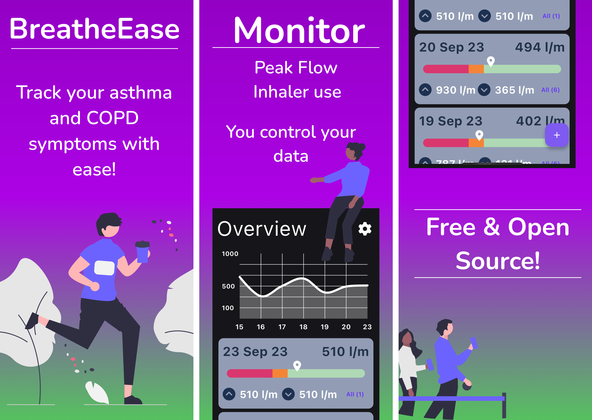

# BreatheEase



A comprehensive asthma tracking app built with Flutter that helps users monitor their peak flow readings, medication usage, and respiratory health patterns.

## Features

- 📊 **Peak Flow Tracking**: Record and visualize peak flow meter readings
- 💊 **Medication Monitoring**: Track preventer and reliever inhaler usage
- 📈 **Data Visualization**: View trends and patterns in your respiratory health
- 📱 **Cross-Platform**: Available on Android, iOS, macOS, Linux, Windows, and Web
- 📱 **Local Storage**: Offline-first approach with local SQLite database

## TODO 

- [ ] Official iOS and Android builds in app stores 
- [ ] Data import and export 
- [ ] Incident tracking 
- [ ] Review Data visualisation 
- [ ] Official Desktop builds 
- [ ] Web version 

## Getting Started

### Prerequisites

- Flutter SDK (>=3.5.3)
- Dependencies required to build Flutter for specific platforms

### Installation

1. **Clone the repository**
   ```bash
   git clone <repository-url>
   cd BreatheEase
   ```

2. **Install dependencies**
   ```bash
   flutter pub get
   ```

3. **Set up environment configuration**
   ```bash
   # Run the setup script to create default environment settings
   ./create-default-env.sh
   ```

4. **Run the app**
   ```bash
   flutter run
   ```

To build for a specific platform use: 

   ```bash
   flutter run -d <platform>
   ```

## Configuration

### Environment Settings

The app uses environment variables for configuration. After running the setup script, you can modify `lib/.env`:

```
USE_LOCAL_STORAGE=true
```
Currently the only value support is: 

- `USE_LOCAL_STORAGE`: Set to `true` to use local SQLite storage

Will be use to toggle features in future that can not be changed through the app UI.

## Development

### Project Structure

```
lib/
├── logic/              # BLoC state management
├── models/             # Data models
├── repositories/       # Data repositories
├── service/           # Services (database, API)
├── widgets/           # Reusable UI components
├── static/            # Constants and static data
└── util/              # Utility functions
```

Most pages are managed by one or more blocs. Most functionality in blocs is accessed through a repository e.g. `peak_flow_reading`. The implimentations abstract the actual implimnetation details from the rest of the code. Repositories take an 'API' implimentation that handles the actual logic. In memory and SQLite implimentations are provided. 

### Running Tests

```bash
# Run all tests
flutter test

# Run tests with coverage
flutter test --coverage
```

### Linting

```bash
# Analyze code
flutter analyze

# Format code
dart format lib/ test/
```

## Building for Release

### Android

   ```bash
   flutter build apk --release
   ```

### iOS

   ```bash
   flutter build ios --release
   ```


## Contributing

1. Fork the repository
2. Create a feature branch (`git checkout -b feature/amazing-feature`)
3. Commit your changes (`git commit -m 'Add amazing feature'`)
4. Push to the branch (`git push origin feature/amazing-feature`)
5. Open a Pull Request

**Please complete the details in pull request template to increase the change of your pr being accepted** 

### Development Guidelines

- Follow the existing code style and patterns
- Write tests for new features
- Update documentation as needed
- Use conventional commit messages

## License

This project is licensed under GPL3, see license file for details.

## Privacy & Terms

- [Privacy Policy](https://sites.google.com/view/breatheeaseapp/privacy)
- [Terms of Service](https://sites.google.com/view/breatheeaseapp/terms-of-service)
- [Contact](https://sites.google.com/view/breatheeaseapp/contact)

## Support

If you encounter any issues or have questions

1. Check the Issues page
2. Create a new issue with detailed information

---

**Disclaimer**: This app is for tracking purposes only and should not replace professional medical advice. Always consult with healthcare professionals for medical decisions.